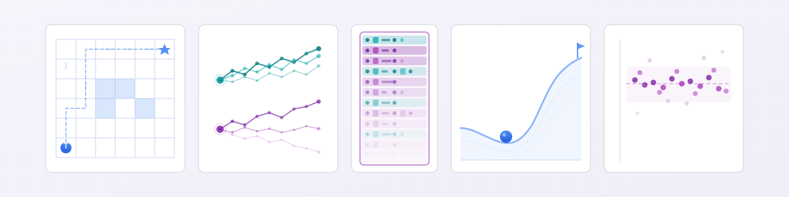

<picture>
  <source media="(prefers-color-scheme: dark)" srcset="doc/jaxtor-dark.svg">
  <source media="(prefers-color-scheme: light)" srcset="doc/jaxtor-light.svg">
  
</picture>

<br>

[](https://www.python.org)
[](https://github.com/jax-ml/jax)
[](https://github.com/TolgaOk/jaxtor)

Composable components for building reinforcement learning algorithms and experiments in .



`jaxtor` handles reinforcement learning (RL) boilerplate so you can focus on the experiment itself.
Pair it with a neural network library such as [`equinox`](https://github.com/patrick-kidger/equinox) and an RL library such as [`rlax`](https://github.com/deepmind/rlax) to build your own experiments.

## Installation

Choose the installation option that matches your needs:

```bash
# Core library
uv add "jaxtor @ git+https://github.com/TolgaOk/jaxtor@v0.2.0"

# Core library with all environment adapters
uv add "jaxtor[env] @ git+https://github.com/TolgaOk/jaxtor@v0.2.0"

# Core library with the dependencies used by the examples
uv add "jaxtor[example] @ git+https://github.com/TolgaOk/jaxtor@v0.2.0"
```

## Usage

Components add one behavior at a time.
For example, `Mc` manages Markov-chain transition sampling, `VecMc` vectorizes it across independent environments, `Imc` forms an induced Markov chain with an action-selecting agent, and `Roll` collects a fixed-length transition sequence.
Together, their configuration forms a visible dependency tree.

```python
roll = Roll(                                # rollout sampler
    imc=Imc(                                # induced MC
        agent=agent,
        mc=VecMc(                           # vectorized MC
            mc=Mc(                          # Markov chain
                max_eps_len=1_000,
                env=env,
            ),
        ),
    ),
    seq_len=2_048,
    seq_axis=1,                             # [batch, time, ...]
)

sequence, state = jax.jit(roll.sample)(state)
```

`jaxtor` uses **dependency injection** through local `Protocol`s.
Most components are independent and do not import other `jaxtor` modules.
Each declares the minimal interface it expects from its dependencies.
For example, `Imc` only expects its agent to provide an `act` method (see [`imc.py`](jaxtor/sampler/imc.py)).
This design removes the need for bulky or heavy-duty classes and keeps components independent, specialized, and lightweight.

When a sampler needs a new feature, such as retaining the `logp` produced by the agent for `act`, that feature is added as another component instead of extending an existing one.
This allows `jaxtor` to scale horizontally.

## Examples

Single-script implementations of common RL algorithms.

- [`examples/q_learning.py`](examples/q_learning.py): tabular Q-learning on Garnet MDP (`jaxdp`)
- [`examples/reinforce.py`](examples/reinforce.py): REINFORCE on CartPole-v1 (`gymnax`)
- [`examples/naf.py`](examples/naf.py): [NAF](https://arxiv.org/abs/1603.00748) on continuous-control environments (`gymnasium` or `envpool`)
- [`examples/ppo.py`](examples/ppo.py): [PPO](https://arxiv.org/abs/1707.06347) on CartPole-v1 (`gymnax`)

## Citation

If you use `jaxtor` in your research, please cite:

```bibtex
@software{tolgaok_jaxtor_2026,
  author  = {Tolga Ok},
  title   = {{Jaxtor}: A composable component library for reinforcement learning experiments},
  year    = {2026},
  version = {0.2.0},
  url     = {https://github.com/TolgaOk/jaxtor},
}
```
