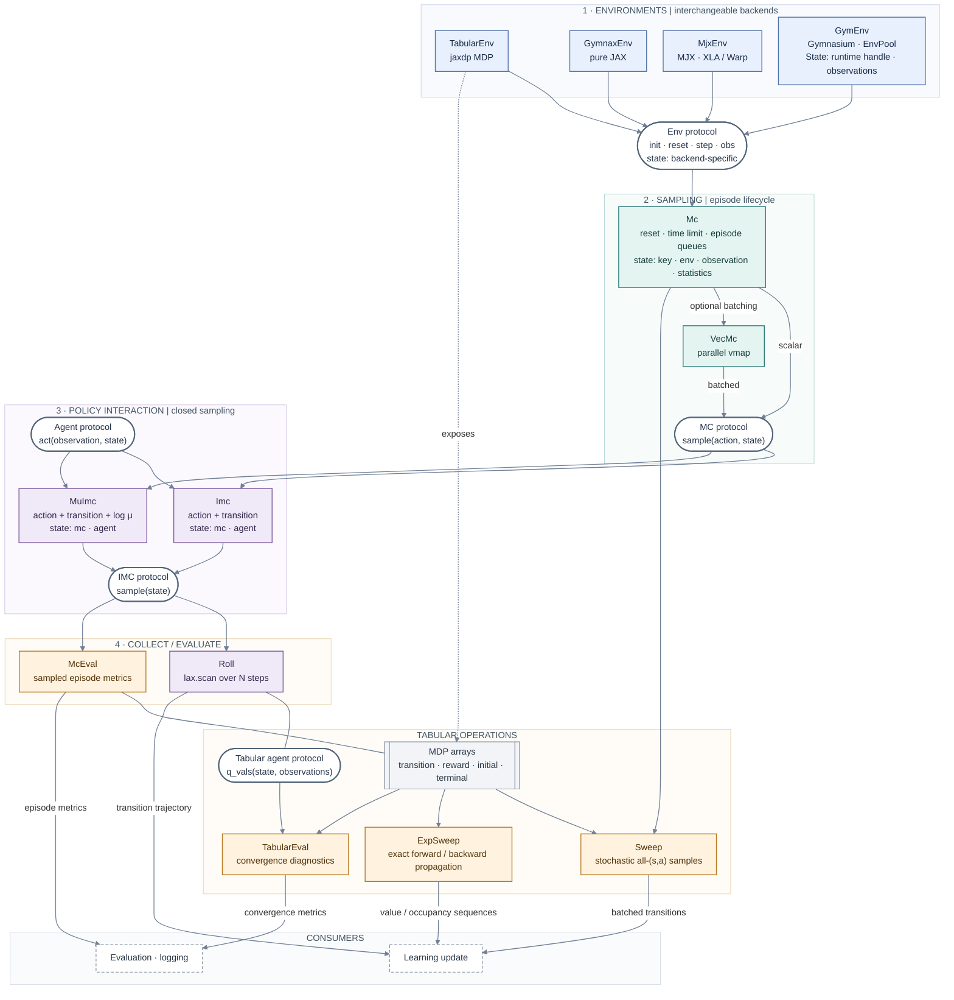

# Component architecture

The sampled runtime path starts with the same environment protocol. The numbered
layers show its composition, while the lower branch shows exact tabular operations.
Each runtime node also shows the explicit state threaded through its calls.

Solid arrows show runtime composition and data flow. Dotted arrows show structural
relationships. Components are configured objects, while dynamic data lives in
explicit state pytrees. The composition can be wrapped in `jit`; `VecMc` uses
`vmap`, `Roll` and `McEval` use `scan`, and `grad` remains available along pure-JAX
environment paths.

## Host-backed Gymnasium boundary

`GymEnv` preserves the component and `State` split even though a mutable
Gymnasium environment cannot be a JAX pytree. The configured component contains
the runtime factory, array schema, and batching rules. `init(key)` creates a
scalar environment when `num_envs` is omitted, or a vector pool when it is an
integer, and returns the state that identifies the process-local runtime.

```mermaid
%%{init: {"theme":"base","themeVariables":{"fontFamily":"Inter, ui-sans-serif, system-ui, sans-serif","fontSize":"15px","lineColor":"#718096","edgeLabelBackground":"#ffffff"},"flowchart":{"curve":"basis","nodeSpacing":30,"rankSpacing":44,"padding":12}}}%%
flowchart LR
    component["GymEnv<br/>factory · schema · batching rules"]
    init["init(key)<br/>create · seed · reset"]
    state[["GymEnv.State<br/>runtime [id · token]<br/>obs · reset_obs"]]
    mc["Mc.sample<br/>scalar environment logic"]
    batch["VecMc + custom_vmap<br/>one vector operation"]
    callback["io_callback<br/>host boundary"]
    store[("runtime store<br/>runtime_id → environment")]
    runtime["Gymnasium runtime<br/>Env when None · VectorEnv when N"]

    component --> init
    init -->|returns| state
    init -. allocates .-> store
    state -->|scalar fields| mc
    component -->|step / reset| mc
    mc -->|scalar| callback
    mc -->|vectorized| batch
    batch -->|one pool step| callback
    callback -->|runtime handle · action| store
    store --> runtime
    runtime -->|transition| callback
    callback -->|arrays · next token| state

    classDef adapter fill:#E8F0FE,stroke:#4E73A8,color:#172A46,stroke-width:1.4px;
    classDef stateNode fill:#F2F4F7,stroke:#7C8798,color:#273444,stroke-width:1.4px;
    classDef sampler fill:#E4F4F1,stroke:#2B7A78,color:#153C3B,stroke-width:1.4px;
    classDef boundary fill:#F0EAF8,stroke:#76559A,color:#35254C,stroke-width:1.4px;
    classDef external fill:#FFF2DE,stroke:#B7791F,color:#51330B,stroke-width:1.4px;

    class component,init adapter;
    class state stateNode;
    class mc,batch sampler;
    class callback boundary;
    class store,runtime external;

    linkStyle default stroke:#718096,stroke-width:1.35px;
```

The two-word runtime handle contains the process-local pool identity and the
sequencing token. The position along the `vmap` axis identifies a pool slot, so
no duplicate slot value is carried through every step. The callback returns the
next token, which becomes an input to the following callback. This data
dependency orders external steps inside `jit` and `scan`. State copies refer to
the same runtime, so each state should be consumed once. The runtime is released
with `env.close(state)`.
