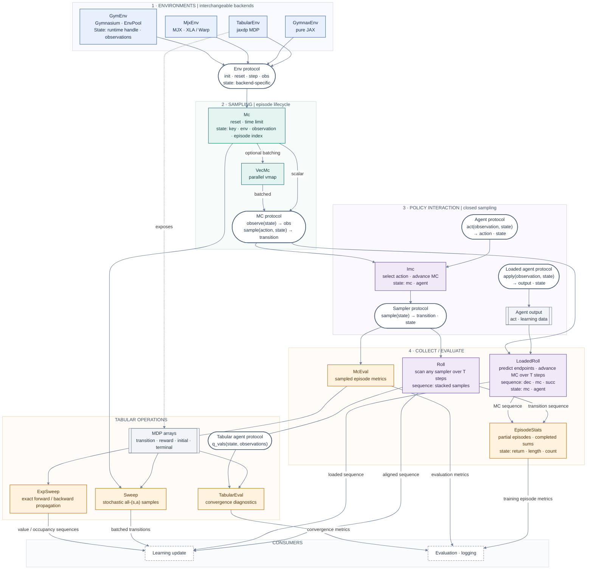

# Component architecture

The sampled runtime path starts with the same environment protocol. The numbered
layers show its composition, while the lower branch shows exact tabular operations.
Each runtime component also shows the explicit state threaded through its calls.

Solid arrows show runtime composition and data flow. Dotted arrows show structural
relationships. Components are configured objects, while dynamic data lives in
explicit state pytrees. The composition can be wrapped in `jit`; `VecMc` uses
`vmap`, while `Roll`, `LoadedRoll`, `EpisodeStats`, and `McEval` use `scan`.
Gradient transforms remain available along pure-JAX environment paths.

## Prediction and learning composition

Agent components form a state tree that mirrors their configured children.
Sampling consumes only `act`, while inference components replay the same agent
through `apply`. This keeps collection small and leaves target computation in
the algorithm that defines it.

```mermaid
%%{init: {"theme":"base","themeVariables":{"fontFamily":"Inter, ui-sans-serif, system-ui, sans-serif","fontSize":"15px","lineColor":"#718096","edgeLabelBackground":"#ffffff"},"flowchart":{"curve":"basis","nodeSpacing":26,"rankSpacing":40,"padding":12}}}%%
flowchart LR
    subgraph model_tree["AGENT STATE TREE"]
        direction TB
        module["Module<br/>callable parameters"]
        norm["ObsNorm + NormModel<br/>explicit statistics"]
        body["Body transform<br/>observation → features"]
        vhead["VHead / QHead / QsaHead<br/>semantic values"]
        pihead["CategoricalHead / DiagNormalHead<br/>policy parameters"]
        dist["Categorical / DiagNormal<br/>pure distributions"]
        select["Draw / Mode<br/>action selection"]
        agent["VPi / VQPi<br/>apply → prediction<br/>act → action"]

        module --> norm --> body
        module --> vhead
        module --> pihead --> dist
        body --> vhead
        body --> pihead
        vhead --> agent
        dist --> agent
        select --> agent
    end

    subgraph collect["COLLECT"]
        direction TB
        imc["Imc<br/>agent.act + MC.sample"]
        roll["Roll<br/>fixed sequence"]
        seq[["Sequence<br/>obs · act · rew · term · trun · nobs"]]
        stats["EpisodeStats"]
        imc --> roll --> seq
        seq --> stats
    end

    subgraph prepare["PREPARE"]
        direction TB
        rew["RewardNorm<br/>explicit return state"]
        inference["VPiNextVInference<br/>agent replay + successor alignment"]
        infer[["Inference<br/>v_tm1 · pi_tm1 · v_t"]]
        target["RLax TD(λ)<br/>algorithm target"]
        batch[["Algorithm batch"]]
        mini["Minibatches<br/>shuffle sample axes"]
        rew --> target
        inference --> infer --> target --> batch --> mini
    end

    subgraph learn["LEARN"]
        direction TB
        split["partition / combine<br/>trainable · frozen state"]
        loss["Algorithm loss"]
        update["Optimizer update"]
        split --> loss --> update
    end

    agent -->|act| imc
    agent -->|apply| inference
    seq --> rew
    seq --> inference
    seq --> batch
    mini --> loss
    agent --> split
    update -->|new agent state| agent

    classDef model fill:#F0EAF8,stroke:#76559A,color:#35254C,stroke-width:1.4px;
    classDef sampler fill:#E4F4F1,stroke:#2B7A78,color:#153C3B,stroke-width:1.4px;
    classDef prepareNode fill:#FFF2DE,stroke:#B7791F,color:#51330B,stroke-width:1.4px;
    classDef data fill:#F2F4F7,stroke:#7C8798,color:#273444,stroke-width:1.2px;
    classDef learnNode fill:#E8F0FE,stroke:#4E73A8,color:#172A46,stroke-width:1.4px;

    class module,norm,body,vhead,pihead,dist,select,agent model;
    class imc,roll,stats sampler;
    class rew,inference,target,mini prepareNode;
    class seq,infer,batch data;
    class split,loss,update learnNode;

    style model_tree fill:#FBF9FD,stroke:#D4C8E5,stroke-width:1px,color:#425466
    style collect fill:#F7FCFA,stroke:#BBDAD4,stroke-width:1px,color:#425466
    style prepare fill:#FFFCF7,stroke:#E8D3AD,stroke-width:1px,color:#425466
    style learn fill:#F8FAFD,stroke:#C8D5E6,stroke-width:1px,color:#425466
    linkStyle default stroke:#718096,stroke-width:1.35px;
```

## Host-backed Gymnasium boundary

`GymEnv` preserves the component and `State` split even though a mutable host
environment cannot be a JAX pytree. `vmap` changes the expected key shape only.
Executing the transformed initializer creates one runtime whose capacity covers
every mapped key. The array state then routes the complete batch to that runtime.
A separately configured adapter may use the state only when its complete
configuration is compatible.

```mermaid
%%{init: {"theme":"base","themeVariables":{"fontFamily":"Inter, ui-sans-serif, system-ui, sans-serif","fontSize":"15px","lineColor":"#718096","edgeLabelBackground":"#ffffff"},"flowchart":{"curve":"basis","nodeSpacing":30,"rankSpacing":44,"padding":12}}}%%
flowchart LR
    component["make(...) → GymEnv<br/>configuration · schema · batching rules"]
    transform["jit / nested vmap<br/>transform key shape only"]
    init["execute init(keys)<br/>capacity = product of mapped axes"]
    state[["GymEnv.State<br/>runtime · token<br/>obs · reset_obs"]]
    mc["Mc.sample<br/>scalar environment logic"]
    batch["VecMc + custom_vmap<br/>accumulate mapped axes"]
    callback["io_callback<br/>host boundary"]
    store[("private runtime store<br/>identity → live backend")]
    runtime["one exact-capacity runtime<br/>Gymnasium · EnvPool"]
    close["close(state)<br/>validate configuration · release"]

    component --> transform --> init
    init -->|returns| state
    init -->|creates once| store
    state -->|complete mapped state| mc
    component -->|step / reset| mc
    mc -->|scalar| callback
    mc -->|vectorized| batch
    batch -->|one runtime transaction| callback
    callback -->|identity · token · action| store
    store --> runtime
    runtime -->|transition| callback
    callback -->|arrays · next token| state
    state --> close --> store

    classDef adapter fill:#E8F0FE,stroke:#4E73A8,color:#172A46,stroke-width:1.4px;
    classDef stateNode fill:#F2F4F7,stroke:#7C8798,color:#273444,stroke-width:1.4px;
    classDef sampler fill:#E4F4F1,stroke:#2B7A78,color:#153C3B,stroke-width:1.4px;
    classDef boundary fill:#F0EAF8,stroke:#76559A,color:#35254C,stroke-width:1.4px;
    classDef external fill:#FFF2DE,stroke:#B7791F,color:#51330B,stroke-width:1.4px;

    class component,transform,init,close adapter;
    class state stateNode;
    class mc,batch sampler;
    class callback boundary;
    class store,runtime external;

    linkStyle default stroke:#718096,stroke-width:1.35px;
```

The runtime identity and sequencing token are explicit array fields. The token
orders external steps inside `jit` and `scan` and rejects stale state before
mutation. The runtime also rejects states whose full mapped shape differs from
the shape used at initialization. `close(state)` accepts stale state for cleanup,
validates the adapter configuration, and releases the referenced runtime. A
private `atexit` fallback closes runtimes that remain at process shutdown.
